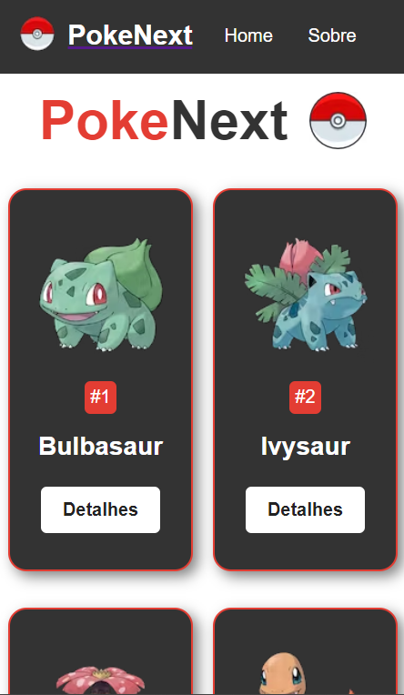

# PokeNext 
## React + Next 

### 🏷️ About 

A website that shows some pokemons and their details.

### 💡 Functionalities 

* API Consumption - Pokeapi
* The home page shows the first 251 pokemons
* You can see the pokemon details by clicking the 'detalhes' button
* the 'sobre' page shows website information
* Response

###  🛠️ Built with

* React
* Next
* Git/GitHub

### 🌐 Website
:link: Link to access the website: [https://poke-next-one-xi.vercel.app/](https://poke-next-one-xi.vercel.app/)

### 📸 Screenshots

### Layout Desktop

### Layout Mobile

### ✒️ Author
## :raising_hand: Thiago Alves

- Linkedin - [Thiago Alves](https://www.linkedin.com/in/thiago-alves-010915274/)
- GitHub - [Thiago87dev](https://github.com/Thiago87dev)
- Frontend Mentor - [@MrThiago87](https://www.frontendmentor.io/profile/MrThiago87)
- Instagram - [@thiagopaulista87](https://www.instagram.com/thiagopaulista87/)

#### Important Note:

This project uses information and images from the Pokémon API to display data about different Pokémon. However, due to restrictions, Pokémon images were downloaded and incorporated locally into the project.

To facilitate the process of obtaining images, I developed a simple Python script that automatically downloads images from the Pokémon API. This script loops through the desired Pokémon and downloads the corresponding images directly to the project directory.

:link: Link to access the python script repository: [https://github.com/Thiago87dev/imageDownloader](https://github.com/Thiago87dev/imageDownloader)